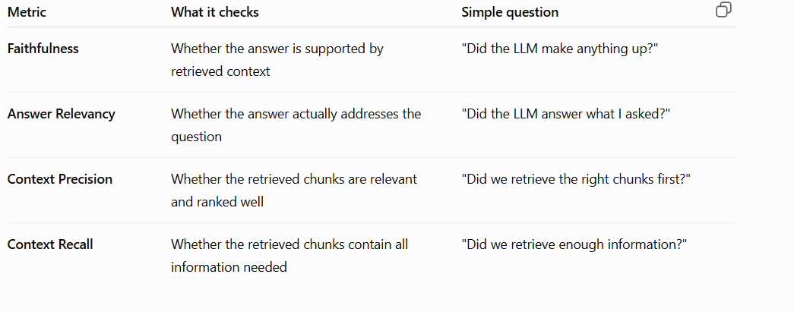

# About the project and workflow
First I created a folder called FD_RAG_ASSISTANT
-inside that folder created a python file called app.py
-requiremnets.txt(libraries which need to be installed)
-created a data folder inside the FD_RAG_ASSISTANT WHERE we can keep the policy documents like pdf,docx
-venv(created virtual environment)
-.env (created a .env file to store the api key inside that  e.x[OPENAI_API_KEY="The key which is created"] )
-.gitignore(These files/folders should NOT be tracked or uploaded to the repository.)
  i) venv(the virtual env has large files so but the file can be installed from requiremnet.txt, type the cmd [pip install -r requirements.txt])
  ii).env(not to exploit the api key)
  iii)__pycache__/(python's cache folder, it is an auto generated cache files by python which can be ignored)
  iv).pyc (compiled ,autogenerated python files used for faster execution which can be ignored)

1.At first we have to create a virtual environment 
-The project dependencies stay separate
-No conflicts with other projects

Q1) How to create a venev?
---cmd
*python -m venv venv (This will create a virtual environment with the name of venv)

2.After creating the virtual environment we have to use the activate function 
-It is a command used to activate your virtual environment in Windows.

---cmd
*venv\Scripts\activate (Instead of global python we are creating isolated virtual env for my particular project)

.venv (inside venv it contains Python interpreter,Installed packages,Scripts to manage environment)
.scripts(it conatain files like activate,python.exe file, pip.exe, this is the place where env file control lives)
.activate(this is the script file which switches terminal to use venv)

example-(venv) C:\Users\Ayush\fd-rag-assistant> (now you are inside venv instead of global python)

3.Now we have install the requred libraries for the particular project so already there is file name called requirement.txt, so need to install it

---cmd
*pip install -r requirements.txt (run this code when you are inside the venv to install the correct libraries)

To check whether everything is installed or not 
---cmd
*pip list

# Explanation on code which has been written

1.
from langchain_community.document_loaders import TextLoader
from langchain_community.document_loaders import PyPDFLoader

Q1)What is langchain_community?
 - module package inisde the Langchain
Q2)What is document_loaders?
 -It contains classes that load data from different sources like pdf,.txt,websites
 -takes raw data and converts them into langchain documnets.
Q3) How the textloader and pypdfloader works?
 - Both the loaders are classes which is used to load text and pdf files.
 -Reads the data and extract them into document object.
Q4) what is document object?
 -A Document object in LangChain is a structured format that contains text data in page_content and additional information in metadata.

2.
from langchain_text_splitters import CharacterTextSplitter
Q1) what is CharacterTextSplitter?
 -CharacterTextSplitter is a class used to split large text into smaller chunks
 -The LLM cannot handle large documnets so we load the data and split te chunks and then convert he chunks into embeddings.

3.
from langchain_community.vectorstores import FAISS
Q1) what is FAISS(facebook AI similarity search)?
-It is a vector database / similarity search engine
-after converting the text into chunks ,then the chunks is converted to embeddings to store an search in vector store through FAISS.

4.
from langchain.chains.retrieval_qa.base import RetrievalQA
Q1) The RetrievalQA is a prebuilt chain by langchain which combines retrieval(FAISS)+ LLM to answer the questions.

5.
from langchain.prompts import PromptTemplate
Q1)what is PromptTemplate?
-it is a tool to create structured prompts for the LLM.
-it is imporatnt to give clear instructions to LLM to answer the questions properly by the gven direction.
-It allows dynamic insertion of variables like context and user queries, ensuring consistent and controlled responses in a RAG pipeline

6.
from langchain_openai import ChatOpenAI, OpenAIEmbeddings
Q1) what is chatopenAI?

-