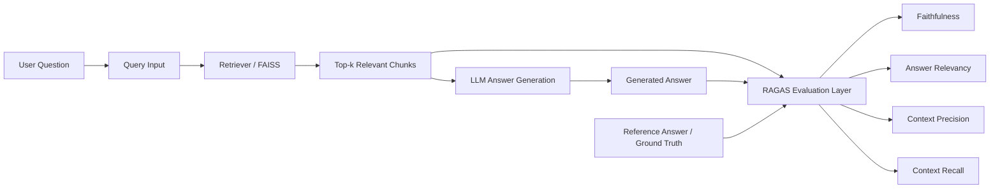

# RAGAS Implementation Review

## Overview
This document outlines a production-safe plan to integrate RAGAS evaluation into the existing RAG pipeline without disrupting the current user experience.

## Current State
The repository currently uses:
- LangChain for orchestration
- FAISS for vector retrieval
- OpenAI models for answer generation
- A simple prompt-based retrieval QA flow

The current implementation is centered in [src/rag_pipeline.py](src/rag_pipeline.py) and [src/app.py](src/app.py).

## Objective
Add RAGAS-based evaluation for the following metrics:
- Faithfulness
- Answer relevancy
- Context precision
- Context recall

The integration should be modular, maintainable, and safe for enterprise use.

## Proposed Approach
1. Keep the existing retrieval and answer generation flow intact.
2. Add a separate evaluation layer that can run independently from the main app flow.
3. Use a lightweight evaluation dataset based on the available policy content.
4. Add the required RAGAS dependencies to [requirements.txt](requirements.txt).
5. Keep environment-based configuration consistent with the current dotenv setup.

## Suggested Implementation Scope
### Files Likely to Change
- [requirements.txt](requirements.txt)
- [src/rag_pipeline.py](src/rag_pipeline.py)
- Optionally [src/app.py](src/app.py) if a separate evaluation entry point is desired
- Optional: a new evaluation script or module for cleaner separation

## Proposed Evaluation Flow
1. Run a set of sample questions against the existing retrieval pipeline.
2. Capture:
   - user question
   - retrieved contexts
   - generated answer
   - expected answer or reference snippet
3. Pass these values into RAGAS metrics.
4. Report scores for faithfulness, relevancy, and context quality.

## Design Principles
- Do not break the existing chat/query experience.
- Prefer a modular evaluation function over hard-wiring evaluation into the runtime path.
- Keep changes minimal and reviewable.
- Avoid unnecessary refactoring.

## Architecture Diagram

## Risks and Considerations
- RAGAS evaluation may require careful handling of retrieved context and reference answers.
- Some metrics may depend on LLM-based judgment, so evaluation should be clearly separated from production responses.
- The dataset should be small and representative before scaling to larger benchmarks.

## Approval Checklist
Before implementation, confirm:
- The preferred evaluation entry point (separate script vs integrated module)
- Whether a sample dataset should be created in the repository
- Whether evaluation output should be printed to console or written to a file
- Whether the current pipeline should remain unchanged for end users during evaluation

## Next Step
Once approved, the implementation can proceed with a minimal patch and verification run.
